# ShopEasy Architecture Diagram

```mermaid
flowchart TB
    User["Customer / administrator"] --> Browser["Web browser"]

    subgraph Presentation["Client and presentation layer"]
        Browser
        Templates["Jinja templates<br/>login, catalog, product, AI Finder,<br/>cart, payment, and success pages"]
        Static["Static CSS and product images"]
    end

    subgraph Application["ShopEasy Flask application"]
        Entrypoint["run.py<br/>Flask app and route handlers"]

        subgraph Routes["HTTP route groups in run.py"]
            Auth["Authentication<br/>/ and /login / /logout"]
            Catalog["Catalog<br/>/products / /product/&lt;id&gt;"]
            Search["Search and AI Finder<br/>/product/search / /ai-chat"]
            Admin["Product maintenance<br/>add / edit / delete"]
            Purchase["Buy-now and payment"]
            Cart["Cart and checkout"]
        end

        subgraph Logic["Models and supporting logic"]
            UserModel["User model<br/>authenticate and password checks"]
            ProductModel["Product model"]
            Validation["Name and phone validation"]
            ChromaService["ChromaProducts<br/>product index operations"]
            Session["Flask session / flash"]
            CartState["Module-level cart list"]
        end

        subgraph Setup["Application setup"]
            Factory["create_app()"]
            Config["Config<br/>DATABASE_URL / SECRET_KEY"]
            SQLAlchemy["Flask-SQLAlchemy"]
            Migrate["Flask-Migrate"]
            Bcrypt["Flask-Bcrypt"]
            ChromaClient["Persistent ChromaDB client"]
        end
    end

    subgraph Persistence["Persistence and external resources"]
        SQLDB[("SQL database<br/>users and products")]
        ChromaDB[("ChromaDB<br/>products_collection")]
        ImageFS[("app/static/images")]
        NoGateway["No payment gateway"]
        NoOrders["No persisted orders"]
    end

    Browser -->|HTTP requests and form data| Entrypoint
    Entrypoint -->|HTML / JSON / redirects| Browser
    Browser -->|Requests assets| Static
    Static --> Browser
    Entrypoint --> Templates
    Entrypoint --> Auth
    Entrypoint --> Catalog
    Entrypoint --> Search
    Entrypoint --> Admin
    Entrypoint --> Purchase
    Entrypoint --> Cart

    Auth -->|Lookup credentials| UserModel
    Auth -->|Store login state| Session
    UserModel -->|Hash / verify password| Bcrypt
    Catalog -->|Read product records| ProductModel
    Search -->|Category and price filters| ProductModel
    Search -->|Semantic text query| ChromaService
    ChromaService -->|Matching product IDs| Search
    Search -->|Resolve IDs and render results| ProductModel
    Search --> Templates
    Admin -->|Create / update / delete| ProductModel
    Admin -->|Index synchronization| ChromaService
    Admin -->|Store uploaded images| ImageFS
    Admin -->|Flash notifications| Session
    Purchase -->|Validate name and phone| Validation
    Purchase -->|Get product and calculate total| ProductModel
    Purchase --> Templates
    Cart -->|Add / update / remove / calculate total| CartState
    Cart -->|Checkout route also reads session cart| Session
    Cart --> Templates

    Factory -->|Load settings| Config
    Factory -->|Initialize extensions and create tables| SQLAlchemy
    Factory -->|Initialize migrations| Migrate
    Factory -->|Initialize password hashing| Bcrypt
    Factory -->|Build Flask application| Entrypoint
    UserModel --> SQLAlchemy
    ProductModel --> SQLAlchemy
    SQLAlchemy <-->|ORM queries and records| SQLDB
    ChromaService --> ChromaClient
    ChromaClient <-->|Documents, metadata, IDs| ChromaDB
    ImageFS --> Static

    Purchase -.->|Collects payment method only| NoGateway
    Purchase -.->|Renders success; does not save order| NoOrders
```

## Component responsibilities

- **`run.py`** contains the route handlers for authentication, catalog browsing, product search, AI Finder, cart, purchase, administration, and sample-data utilities. The route responsibility boxes above are logical groupings, not separate modules.
- **`app.create_app()`** loads `Config`, initializes SQLAlchemy, Flask-Migrate, and Flask-Bcrypt, imports the models, and creates database tables.
- **SQL database** is the source of truth for users and products. Authentication and product operations use the SQLAlchemy models.
- **ChromaDB** provides semantic product search. Product text and metadata are indexed there; search returns product IDs that route handlers resolve through SQL.
- **Product images** are saved locally under `app/static/images` and served by Flask as static assets.
- **Cart and order limitations:** the primary cart is a process-local Python list; `/cart-checkout` separately reads `session["cart"]`. Payment routes collect a method and display success pages, but do not call a payment gateway or persist orders.
- **Access-control limitation:** the current product-management routes do not enforce administrator authorization.
