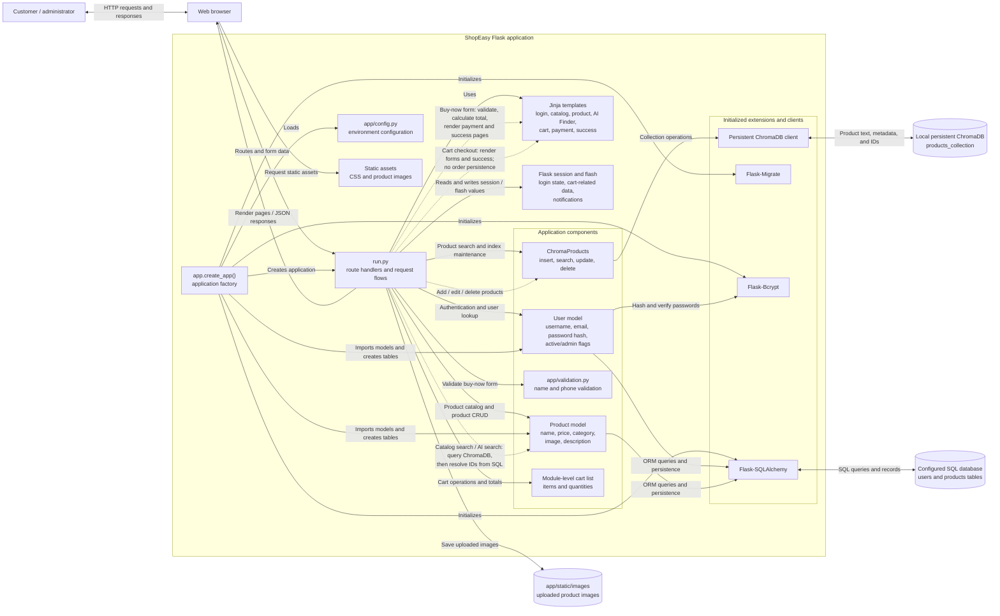

# ShopEasy Project Process Flow

## Step-by-step process

### 1. Application startup

1. `run.py` calls `create_app()` to create the Flask application.
2. The app loads settings from `app/config.py`, including the database URL and Flask secret key.
3. SQLAlchemy, Flask-Migrate, and Flask-Bcrypt are initialized; the SQLAlchemy models create the database tables if needed.
4. `app/extensions.py` creates the persistent ChromaDB client, and `app/vectorDb/chromaproducts.py` exposes the product search operations.
5. Flask starts serving the registered routes.

### 2. Customer sign-in and catalog browsing

1. A visitor opens the home page. If already signed in, the app redirects them to `/products`; otherwise it displays the login page.
2. On login submission, the app checks the username and password against the `User` record.
3. A successful login stores the username, user ID, admin flag, and logged-in state in the Flask session. Invalid credentials redisplay the login page with an error.
4. The catalog route loads products from the SQL database and renders the product list. Visitors can also open an individual product detail page.
5. Login is optional for the product and purchase routes in the current implementation; the routes do not enforce authentication.

### 3. Product search and AI Finder

1. A visitor can search the catalog using `/product/search` or open the AI Finder page and submit a natural-language request to `/ai-chat`.
2. Catalog search sends the query to ChromaDB, which returns matching product IDs; the app loads those products from SQL and renders the results.
3. AI Finder checks for an empty prompt, then extracts a category, product keywords, and optional lower/upper price constraints. It also recognizes cheapest/most-expensive requests and approximate spelling.
4. If a category is detected, matching products are read from SQL. Otherwise, ChromaDB performs semantic search and the returned IDs are looked up in SQL.
5. The AI flow applies product-name/category matching and applicable price filters.
6. The endpoint returns product data and a result message, or a no-match message if it found no products.

### 4. Buy-now purchase

1. The customer selects a product and opens its buy form.
2. On submission, the app reads customer name, phone, address, and quantity.
3. Name and phone validation run in sequence. A validation error is returned if either check fails.
4. If valid, the app calculates the total and displays the payment form.
5. The customer submits a payment method; the app renders a success page.

### 5. Cart purchase

1. The customer adds a product to the module-level in-memory cart. Adding an already-present product increments its quantity.
2. The customer views the cart and may increase/decrease quantities or remove products.
3. The cart page's checkout link opens `/cart-checkout`. That route reads `session["cart"]`; if it is empty, the app redirects back to `/cart`.
4. If session cart data exists, the checkout page displays its totals and links to `/cart-payment`.
5. `/cart-payment` separately checks the module-level cart. If that cart is empty, it redirects to `/cart`; otherwise it displays the payment form.
6. On payment submission, the app copies the module-level cart, clears it, and renders the cart success page.

### 6. Product administration

1. The product form accepts a name, price, category, description, and optional image.
2. Add-product saves the image under `app/static/images`, inserts the product into SQL, then indexes its searchable text in ChromaDB.
3. Edit-product updates the SQL record and, when supplied, the image; it then updates the ChromaDB document and metadata.
4. Delete-product removes the product from ChromaDB, deletes its SQL record, and redirects to the catalog.
5. These routes update notifications in the Flask session. The current implementation does not enforce administrator authorization on these routes.

## Mermaid component architecture diagram

### Architecture notes

- `run.py` is the HTTP route/controller layer; it coordinates templates, application models, validation, the cart list, and ChromaDB operations.
- `app.create_app()` loads environment-backed settings and initializes SQLAlchemy, Flask-Migrate, and Flask-Bcrypt. The factory imports the models and calls `db.create_all()`.
- SQL is the source of truth for `User` and `Product` records. ChromaDB stores searchable product text and metadata; search result IDs are resolved back to SQL product records.
- Product image uploads are written to the local `app/static/images` directory and served as static assets.
- The architecture has no payment gateway integration or persisted order model. Payment routes render success views after receiving a selected payment method.

## Mermaid process diagram

```mermaid
flowchart TD
    Start([Start run.py]) --> App[Create Flask app]
    App --> Config[Load configuration and initialize extensions]
    Config --> Tables[Create SQL tables if needed]
    Tables --> Serving[Serve Flask routes]

    Serving --> Visitor[Visitor]
    Visitor --> Home[Open home page]
    Home --> SignedIn{Already signed in?}
    SignedIn -->|Yes| Catalog[Load product catalog from SQL]
    SignedIn -->|No| LoginPage[Show login page]
    LoginPage --> LoginSubmit[Submit username and password]
    LoginSubmit --> Authenticate{Credentials valid?}
    Authenticate -->|No| LoginError[Show login error]
    LoginError --> LoginPage
    Authenticate -->|Yes| Session[Set Flask session]
    Session --> Catalog

    Catalog --> ProductDetail[Open product detail]
    Catalog --> CatalogSearch[Submit catalog search]
    CatalogSearch --> ChromaSearch[Search product text in ChromaDB]
    ChromaSearch --> SearchIDs[Load matching product IDs from SQL]
    SearchIDs --> SearchResults[Render search results]

    Catalog --> Finder[Open AI Finder and submit prompt]
    Finder --> Empty{Prompt empty?}
    Empty -->|Yes| EmptyReply[Return prompt-required message]
    Empty -->|No| Parse[Parse category, keywords, and price constraints]
    Parse --> HasCategory{Category detected?}
    HasCategory -->|Yes| CategorySQL[Find category products in SQL]
    HasCategory -->|No| SemanticSearch[Search ChromaDB]
    SemanticSearch --> AIIDs[Load matching IDs from SQL]
    CategorySQL --> Filters[Apply product and price filters]
    AIIDs --> Filters
    Filters --> HasResults{Products found?}
    HasResults -->|No| NoMatch[Return no-match message]
    HasResults -->|Yes| AIResults[Return product data and result message]

    ProductDetail --> Purchase{Choose purchase path}
    SearchResults --> Purchase
    AIResults --> Purchase
    Purchase -->|Buy now| BuyForm[Submit customer details and quantity]
    BuyForm --> Validate[Validate name and phone]
    Validate -->|Invalid| ValidationError[Return validation error]
    ValidationError --> BuyForm
    Validate -->|Valid| SinglePayment[Calculate total and show payment form]
    SinglePayment --> SinglePaySubmit[Submit payment method]
    SinglePaySubmit --> SingleSuccess[Render purchase success page]

    Purchase -->|Add to cart| AddCart[Add product or increment quantity]
    AddCart --> CartView[View cart and update/remove items]
    CartView --> CartTotal[Calculate item count and total]
    CartTotal --> CheckoutRoute[Open cart-checkout route]
    CheckoutRoute --> SessionCart{Session cart populated?}
    SessionCart -->|No| CartView
    SessionCart -->|Yes| CheckoutView[Display checkout summary]
    CheckoutView --> CartPayRoute[Open cart-payment route]
    CartPayRoute --> MemoryCart{In-memory cart populated?}
    MemoryCart -->|No| CartView
    MemoryCart -->|Yes| CartPay[Submit cart payment]
    CartPay --> ClearCart[Copy order details and clear in-memory cart]
    ClearCart --> CartSuccess[Render cart success page]

    Serving --> Admin[Product add/edit/delete routes]
    Admin --> ProductChange[Validate form data and save optional image]
    ProductChange --> SQLProducts[(SQL product records)]
    ProductChange --> ChromaProducts[(Persistent ChromaDB product index)]
    SQLProducts --> Catalog
    ChromaProducts --> Catalog
```

## Implementation notes

- SQLAlchemy is the source of product and user records; ChromaDB is used for product text search and returns IDs that are resolved through SQL.
- The buy-now and cart payment routes render success pages after receiving a payment method; no external payment processor or persisted order record is implemented.
- The main cart uses the module-level in-memory `cart` list. The separate `/cart-checkout` route reads `session["cart"]`, so it is not the same checkout data path used by `/cart-payment`.
- `/add-old-products` and `/admin-to-users-table` are utility routes that insert sample products and an admin user.
