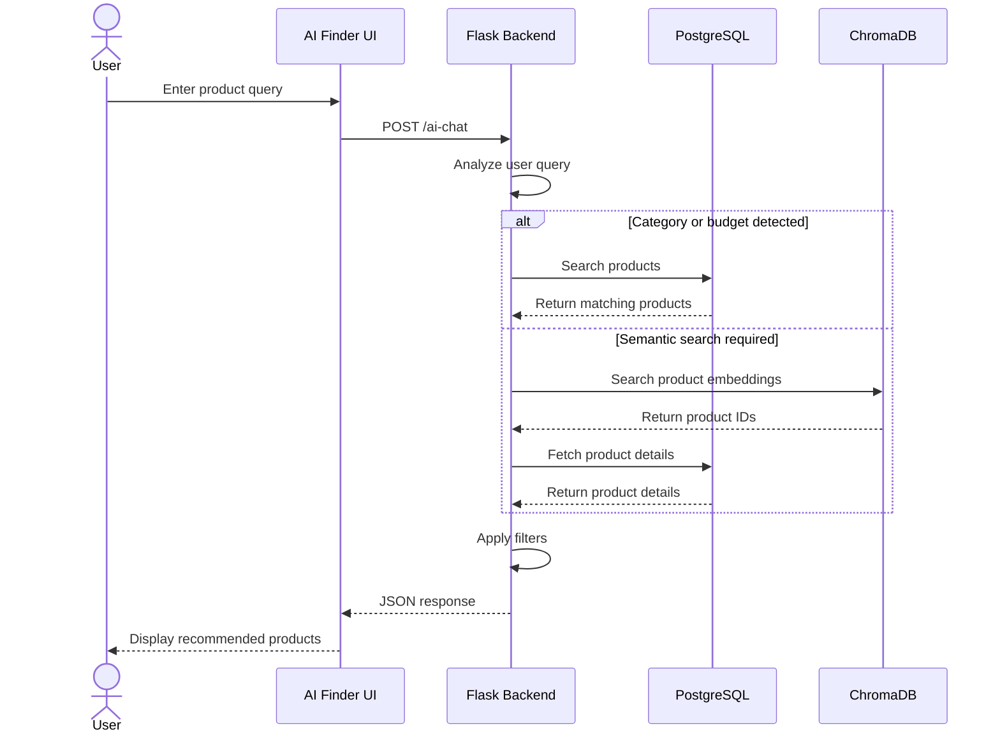

```mermaid
sequenceDiagram
    actor User
    participant UI as AI Finder UI
    participant Flask as Flask Backend
    participant DB as PostgreSQL
    participant Chroma as ChromaDB

    User->>UI: Enter product query
    UI->>Flask: POST /ai-chat
    Flask->>Flask: Analyze user query

    alt Category or budget detected
        Flask->>DB: Search products
        DB-->>Flask: Return matching products
    else Semantic search required
        Flask->>Chroma: Search product embeddings
        Chroma-->>Flask: Return product IDs
        Flask->>DB: Fetch product details
        DB-->>Flask: Return product details
    end

    Flask->>Flask: Apply filters
    Flask-->>UI: JSON response
    UI-->>User: Display recommended products
```
